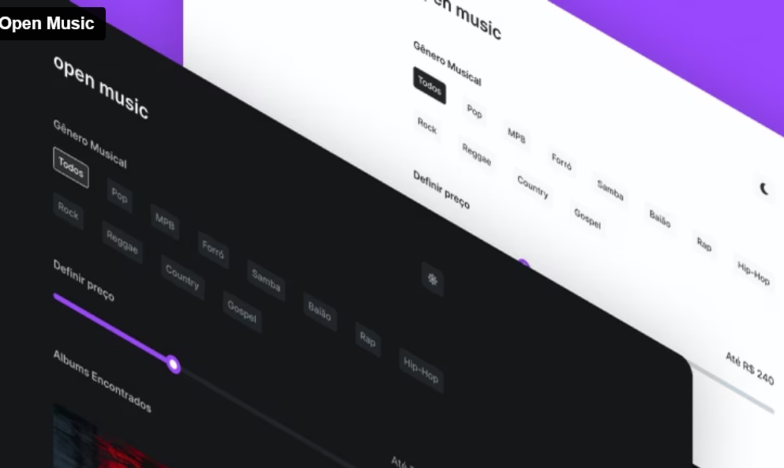

<h1 align="center"> Open Music </h1>

Programa exclusivo, promovido pela Kenzie Academy para ensino de tecnologias WEB.  

  <a href="#-tecnologias">Tecnologias</a>&nbsp;&nbsp;&nbsp;|&nbsp;&nbsp;&nbsp;
  <a href="#-projeto">Projeto</a>&nbsp;&nbsp;&nbsp;|&nbsp;&nbsp;&nbsp;
  <a href="#-layout">Layout</a>&nbsp;&nbsp;&nbsp;|&nbsp;&nbsp;&nbsp;
  <a href="#-aprendizados">Aprendizados</a>&nbsp;&nbsp;&nbsp;|&nbsp;&nbsp;&nbsp;
  <a href="#memo-licença">Licença</a>

  

 

  

## 🖱️ Tecnologias

Esse projeto foi desenvolvido com as seguintes tecnologias:

- HTML e CSS
- JavaScript
- Git e Github
- Figma

## 🔊 Projeto

Na Open Music, os usuários podem filtrar por categoria musical e definir um preço máximo para os produtos desejados. Além disso, existe a opção de escolher o tema de interface que mais lhe agrada, proporcionando uma experiência de compra personalizada e intuitiva. Explore a diversidade musical e faça suas escolhas.

- [Acesse o projeto finalizado, online](https://kenzie-academy-brasil-developers.github.io/open-music-template_Miguellljr/)

## 🧠 Aprendizados

- Compreensão da arquitetura básica de projetos escaláveis.
- Implementação efetiva do Dark Mode, proporcionando uma experiência visual flexível.
- Utilização do Local Storage para armazenar as preferências do usuário e garantir uma experiência personalizada.
- Criação e renderização eficiente de elementos via DOM, unificando a  aplicação de diferentes filtros simultâneos, como preço e categoria.

## 💻 Layout

Você pode visualizar o layout do projeto através [DESSE LINK](https://www.figma.com/file/jKimPFfodALZVnFgITEosd/%5BM2%5D-%F0%9F%8F%81-Entrega---Open-Music?type=design&node-id=3-214&mode=design&t=308aGroX3iwxELoM-0). É necessário ter conta no [Figma](https://figma.com) para acessá-lo.

## 📌 Licença

Esse projeto está sob a licença MIT.

---